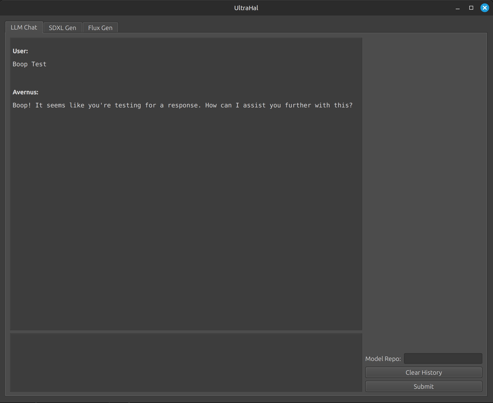
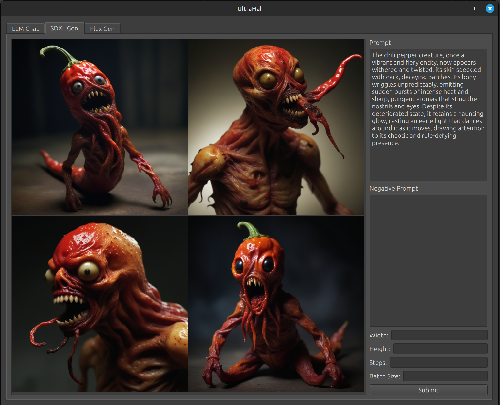
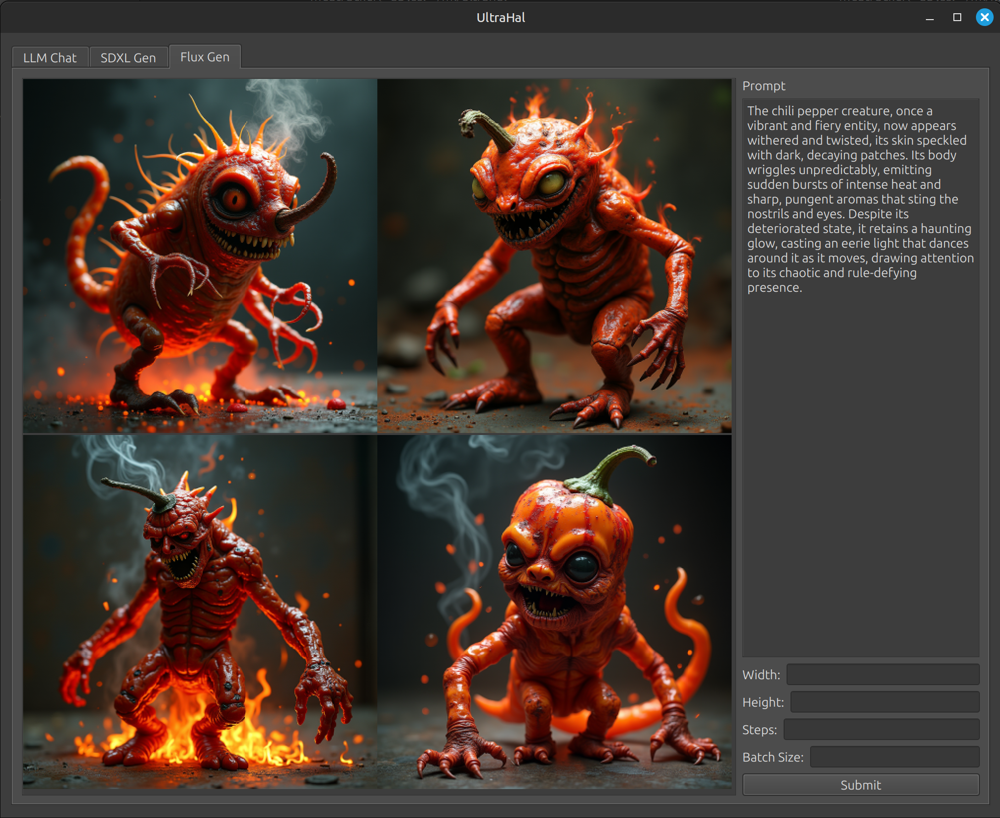

# ultrahal

This is a simple pyside6 GUI client for interfacing with the avernus API server which can be obtained here: https://github.com/Meatfucker/avernus

It has a llm chat, sdxl generation, and flux-dev generation. In the image generation mode images can be clicked to full screen them.

# Install Guide:

Create a python environment using python venvs or conda, whichever you prefer.

Enter the environment and install the requirements file.

Run ultrahal.py and pray I didnt miss any requirements. If I did install them via pip and try again. Preferably letting me know via an issue so I can fix it.

# TODO:

- Lots, lol
- Make image right clickable to save or open in browser
- Add lora support for image models
- Provide feedback something is generating
- Eventually figure out how to run these async calls without pyside6 losin its shit at me.
- Add support for controlnets
- Add support for inpainting
- Make pressing enter in the server url entry update the server.
- Display current server
- Make pressing enter on gen tabs press generate
