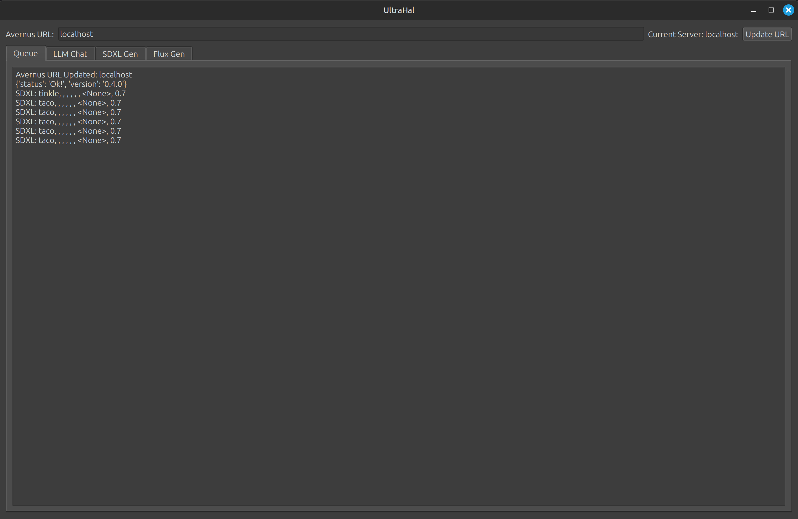
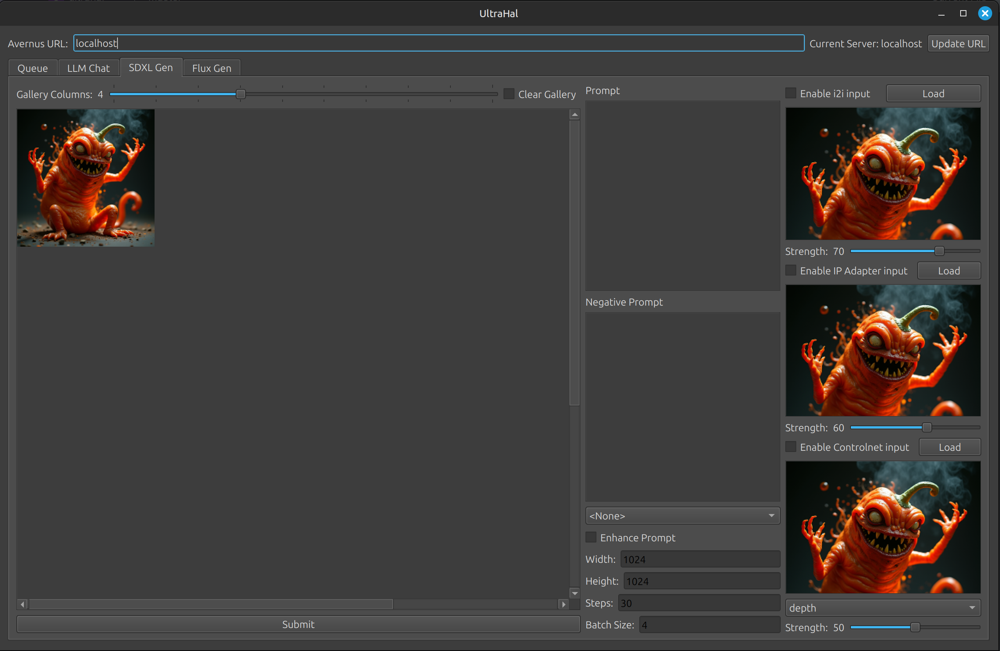

# ultrahal

This is a simple pyside6 GUI client for interfacing with the avernus API server which can be obtained here: https://github.com/Meatfucker/avernus

It has a llm chat, sdxl generation, and flux-dev generation. In the image generation mode images can be clicked to full screen them.

# Install Guide:
Ensure you have python installed
Run either install_windows.bat or install_linux.sh
Run either start_ultrahal.bat or start_ultrahal.sh

# TODO:

- Add model selection
- Add support for inpainting
- Add video pipelines
- Add Audio Pipelines
